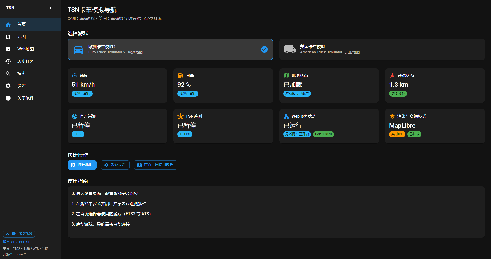
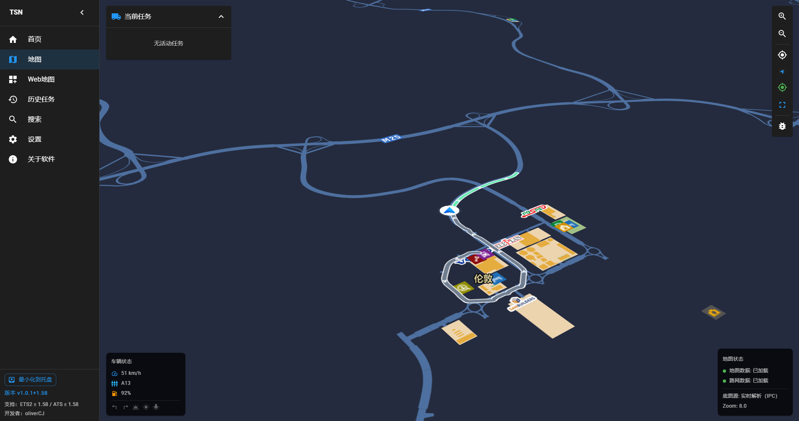

# Truck Sim Navigator

Truck Sim Navigator 是一款面向 **Euro Truck Simulator 2 (ETS2)** 和 **American Truck Simulator (ATS)** 的桌面导航软件。

它可以在你游戏时提供实时地图定位、路线规划和导航信息展示。

- 官网：<https://www.trucksn.top/>
- 当前版本：`v1.0.7`

## 支持游戏版本
- ETS2：最高支持 1.60（大版本号，向下兼容，官方已经发布正式版，已测试）。
- ATS：最高支持 1.60（大版本号，向下兼容，官方已经发布正式版，已测试）。
- 当游戏版本高于当前支持上限时，软件会提示先更新版本后再加载地图。

## 它能做什么

- 实时显示车辆在地图中的位置
- 规划驾驶路线并展示导航路径
- 展示速度、油量等遥测相关信息
- 提供更清晰的地图查看与驾驶辅助体验

## 下载与安装

1. 打开本仓库的 **Releases** 页面下载最新安装包。
2. 运行安装程序并完成安装。
3. 首次启动后，按设置向导选择 ETS2/ATS 游戏目录。

## 快速开始（首次使用）

1. 启动 Truck Sim Navigator。
2. 在设置中选择你正在使用的游戏（ETS2 或 ATS）。
3. 配置游戏路径并加载地图数据。
4. 进入游戏开始驾驶，软件会显示实时位置与导航信息。

## 软件截图

## 常见问题

### 1) 打开软件后看不到实时位置

请先确认：

- 已正确选择游戏目录
- 游戏正在运行中
- 软件与游戏版本匹配

### 2) 地图没有加载出来

请先确认：

- 游戏目录配置正确
- 地图数据已完成加载
- 首次加载时等待数据处理完成

### 3) 去哪里看每个版本更新了什么

可以查看版本发布说明目录：

- [release-notes](https://www.trucksn.top/releases/)

## 反馈与支持

如果你在使用中遇到问题，建议在仓库 Issues 中提交：

- 问题现象
- 软件版本号
- 操作系统版本
- 复现步骤

这样可以更快定位并修复问题。
